# Better Life Hospital

Better Life Hospital is a Java Swing based hospital management application backed by a MySQL database.

It provides a simple desktop interface for managing hospital-related activities such as patients, doctors, appointments, prescriptions, medicine items, sales, and users.

---

## Features

- Admin dashboard
- Login system
- Patient registration
- Doctor registration
- Create appointments
- View appointments
- View prescriptions
- Create drug/medicine items
- Sale drugs
- Create users
- View doctors list

---

## Screenshots

> Keep all screenshots inside a folder named `screenshots` in the project root.

### Admin Dashboard

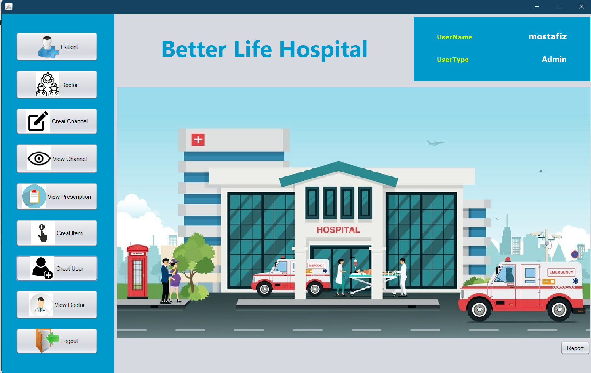

### Login

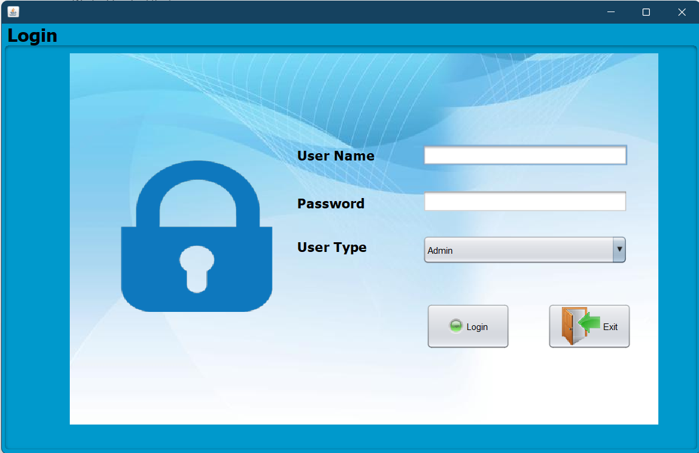

### Patient Registration

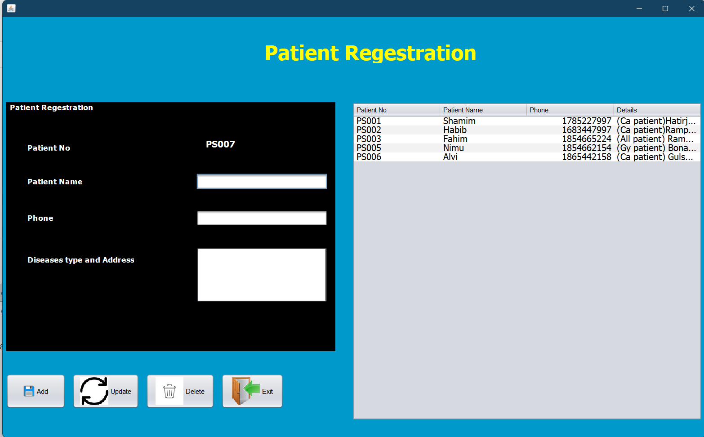

### Doctor Registration

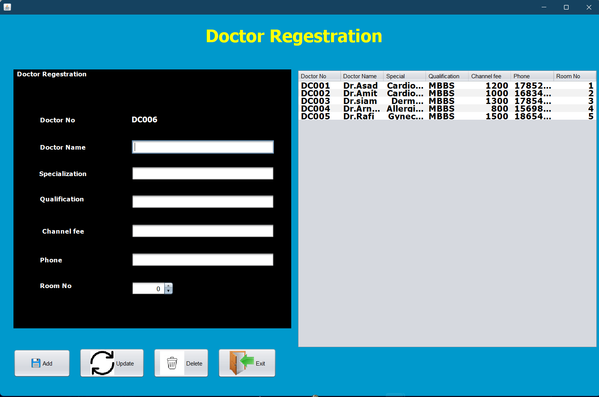

### Create Appointment

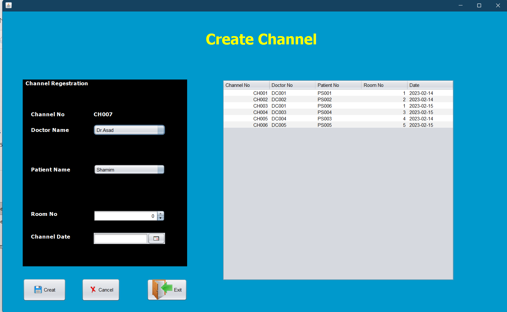

### View Appointments

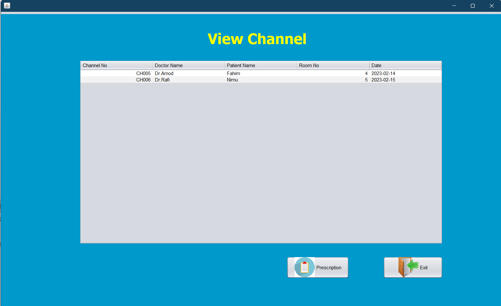

### View Prescriptions

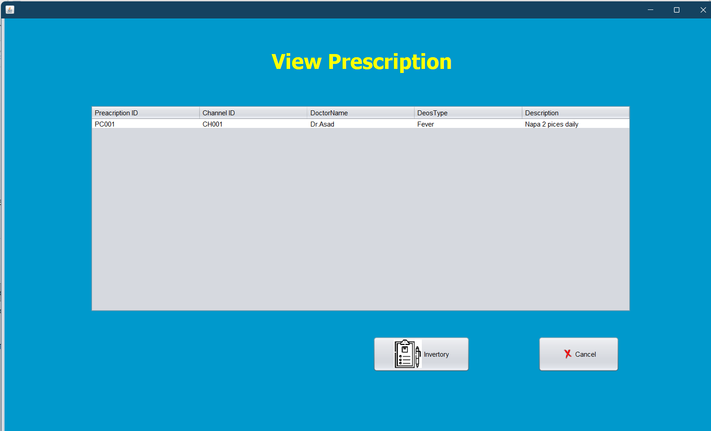

### Sale Drugs

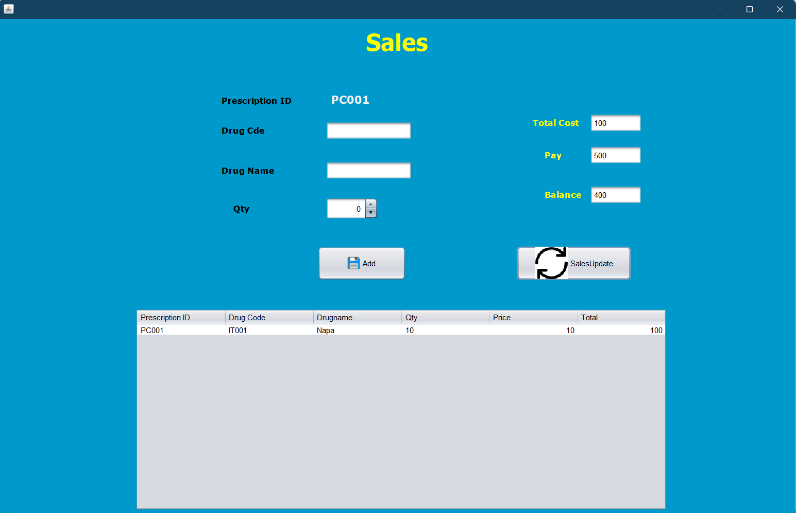

### User Creation

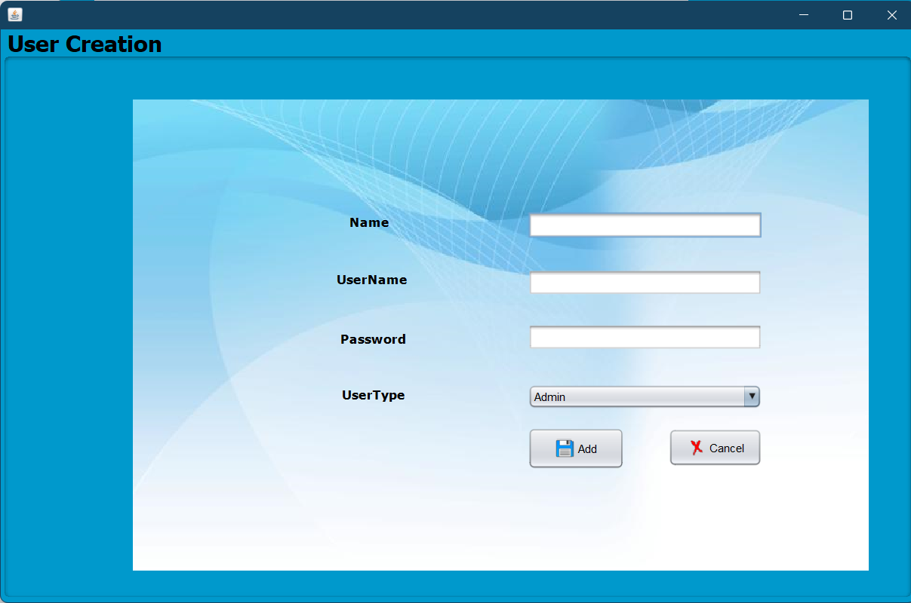

### Doctors List

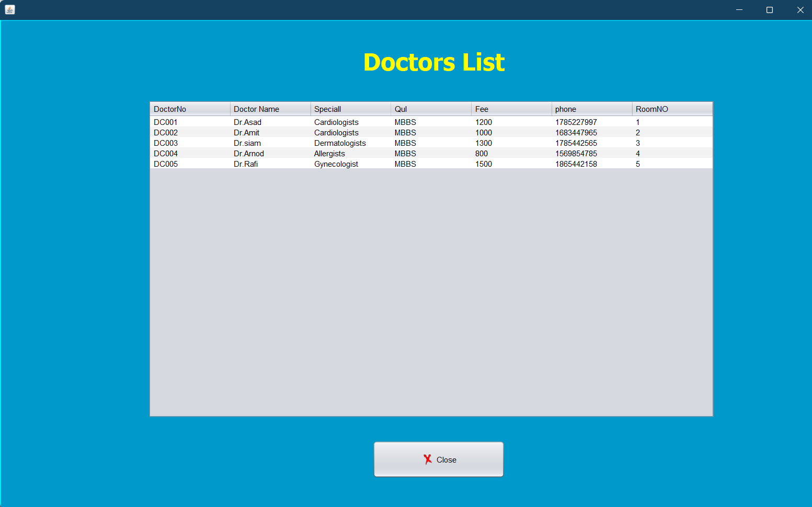

### Create Drug Item

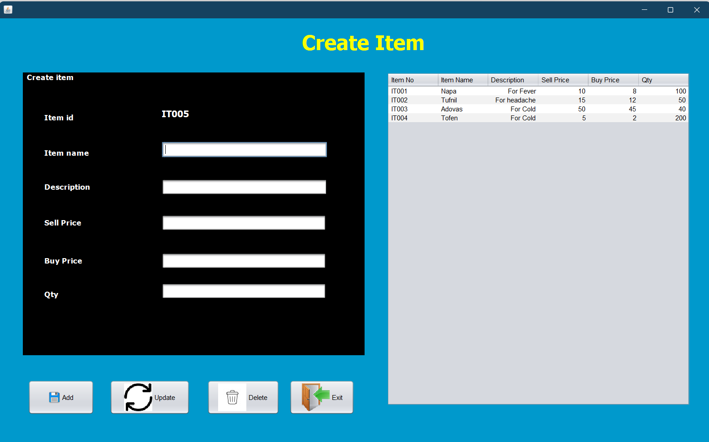

---

## Requirements

- JDK 8 or newer
- MySQL Server or MariaDB Server
- Java libraries included in the `lib/` folder
- Optional: XAMPP with phpMyAdmin

XAMPP is not required. The project can be run using either XAMPP/phpMyAdmin or normal MySQL command line.

---

## Project Structure

```text
BetterLifeHospital/
│
├── lib/
│   └── Required Java libraries
│
├── scripts/
│   ├── build.ps1
│   └── run.ps1
│
├── src/
│   └── Java source files
│
├── screenshots/
│   └── Project screenshots
│
├── betterlifehospital.sql
└── README.md
```

---

## Database Information

The application uses the following database by default:

```text
Database Name: betterlifehospital
Host: localhost
Port: 3306
Username: root
Password: root
```

If your MySQL password is different, you can set environment variables before running the application.

---

## Database Setup Option 1: Using XAMPP and phpMyAdmin

Use this method if you want to run MySQL through XAMPP.

### Step 1: Start XAMPP

Open **XAMPP Control Panel** and start:

```text
Apache
MySQL
```

### Step 2: Open phpMyAdmin

Open your browser and go to:

```text
http://localhost/phpmyadmin
```

### Step 3: Create Database

Click **New** from the left sidebar.

Create a database named:

```text
betterlifehospital
```

Then click **Create**.

### Step 4: Import SQL File

1. Select the `betterlifehospital` database.
2. Go to the **Import** tab.
3. Click **Choose File**.
4. Select the file:

```text
betterlifehospital.sql
```

5. Click **Import** or **Go**.

After import, the database should contain these tables:

```text
channel
doctor
item
patient
prescription
sale_product
sales
user
```

---

## Database Setup Option 2: Without XAMPP Using MySQL Command Line

Use this method if you installed MySQL Server directly and want to use the MySQL CLI.

### Step 1: Open PowerShell or CMD

Go to the project root folder where `betterlifehospital.sql` is located.

Example:

```powershell
cd D:\Sem3\project\BetterLifeHospital
```

### Step 2: Import the Database

Run this command from PowerShell or CMD:

```powershell
mysql -u root -p < betterlifehospital.sql
```

Enter your MySQL password when asked.

This will import the database from the SQL file.

Do not run this command inside the `mysql>` monitor prompt. If you are already inside MySQL, type `exit;` first, then run the import command from PowerShell or CMD.

### Step 3: Login to MySQL

Run:

```powershell
mysql -u root -p
```

Enter your password.

### Step 4: Check the Database

Inside the MySQL monitor, run:

```sql
SHOW DATABASES;
```

Then select the database:

```sql
USE betterlifehospital;
```

Now show the tables:

```sql
SHOW TABLES;
```

You should see:

```text
channel
doctor
item
patient
prescription
sale_product
sales
user
```

To check the user table:

```sql
SELECT * FROM `user`;
```

The backticks are used because `user` can sometimes be treated as a special name in MySQL.

---

## Database Credentials

By default, the application expects:

```text
Database: betterlifehospital
Host: localhost
Port: 3306
Username: root
Password: root
```

If your MySQL password is not `root`, set the environment variables before running the app.

In PowerShell:

```powershell
$env:BLH_DB_USER = "root"
$env:BLH_DB_PASSWORD = "your_mysql_password"
$env:BLH_DB_URL = "jdbc:mysql://localhost:3306/betterlifehospital?useSSL=false&allowPublicKeyRetrieval=true&serverTimezone=UTC"
```

Example:

```powershell
$env:BLH_DB_USER = "root"
$env:BLH_DB_PASSWORD = "12345"
$env:BLH_DB_URL = "jdbc:mysql://localhost:3306/betterlifehospital?useSSL=false&allowPublicKeyRetrieval=true&serverTimezone=UTC"
```

---

## Run the Application

Make sure MySQL is running before opening the application.

Open PowerShell from the project root folder.

Example:

```powershell
cd D:\Sem3\project\BetterLifeHospital
```

Run:

```powershell
.\scripts\run.ps1
```

If PowerShell blocks the script, run:

```powershell
Set-ExecutionPolicy -Scope Process -ExecutionPolicy Bypass
```

Then run again:

```powershell
.\scripts\run.ps1
```

If the project runs successfully, the Java Swing application window will open.

---

## Build Only

To compile the project without running the application:

```powershell
.\scripts\build.ps1
```

After successful build, compiled files will be generated inside:

```text
build/classes
```

---

## Sample Login

Use the following login credentials:

```text
Username: mostafiz
Password: 12345
User Type: Admin
```

---

## Common MySQL Commands

Login to MySQL:

```powershell
mysql -u root -p
```

Show all databases:

```sql
SHOW DATABASES;
```

Select project database:

```sql
USE betterlifehospital;
```

Show all tables:

```sql
SHOW TABLES;
```

View users:

```sql
SELECT * FROM `user`;
```

View patients:

```sql
SELECT * FROM patient;
```

View doctors:

```sql
SELECT * FROM doctor;
```

View appointments:

```sql
SELECT * FROM channel;
```

Exit MySQL:

```sql
exit;
```

---

## Screenshot File Names

For the README screenshots to work properly, save your images with these exact names:

```text
screenshots/adminDashboard.png
screenshots/login.png
screenshots/patientRegistration.png
screenshots/doctorRegistration.png
screenshots/createAppointment.png
screenshots/viewAppointments.png
screenshots/viewPrescriptions.png
screenshots/saleDrugs.png
screenshots/userCreation.png
screenshots/doctorsList.png
screenshots/createDrugItem.png
```

Folder structure should look like this:

```text
BetterLifeHospital/
│
├── screenshots/
│   ├── adminDashboard.png
│   ├── login.png
│   ├── patientRegistration.png
│   ├── doctorRegistration.png
│   ├── createAppointment.png
│   ├── viewAppointments.png
│   ├── viewPrescriptions.png
│   ├── saleDrugs.png
│   ├── userCreation.png
│   ├── doctorsList.png
│   └── createDrugItem.png
```

---

## Troubleshooting

### PowerShell says `run.ps1 is not recognized`

Use:

```powershell
.\scripts\run.ps1
```

If you are already inside the `scripts` folder, use:

```powershell
.\run.ps1
```

---

### PowerShell blocks the script

Run:

```powershell
Set-ExecutionPolicy -Scope Process -ExecutionPolicy Bypass
```

Then run the project again:

```powershell
.\scripts\run.ps1
```

---

### Database connection error

Check that MySQL is running.

If using XAMPP, start MySQL from XAMPP Control Panel.

If using normal MySQL Server, make sure the MySQL service is running.

Also check your password. If your MySQL password is not `root`, set:

```powershell
$env:BLH_DB_PASSWORD = "your_mysql_password"
```

---

### Database not found

Login to MySQL:

```powershell
mysql -u root -p
```

Then check:

```sql
SHOW DATABASES;
```

If `betterlifehospital` is missing, import the SQL file again:

```powershell
mysql -u root -p < betterlifehospital.sql
```

This import command must be run from PowerShell or CMD, not from inside the `mysql>` prompt.

---

### Tables not showing

Inside MySQL, run:

```sql
USE betterlifehospital;
SHOW TABLES;
```

If no tables appear, import the SQL file again.

---

## Technologies Used

- Java
- Java Swing
- MySQL
- JDBC
- PowerShell

---

## Author

**Mostafiz Fahim**
